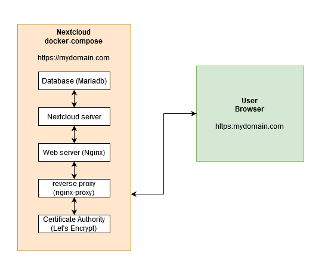
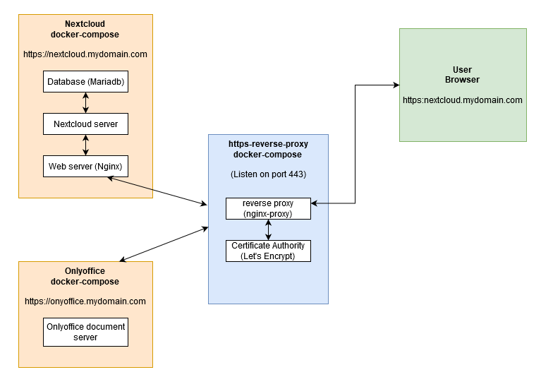

# nextcloud-docker
Nextcloud + OnlyOffice installation with docker and docker compose

> Note : This documentation suppose you already have installed docker and docker-compose on your server, and that you have basic knowledges with those tools.

## What this repository will get to you : 
- A secure Nextcloud server with https provided by Letsencrypt
- OnlyOffice Integration
- ClamAv antivirus for uploaded files
- A WebDav example for additional disk
- A simple additional virtual web site (nginx welcome page) to get a minimal example on how to extand your web server.

**This repository is intended to share one possibility to host a complete and secure nextcloud server.**

At first i wanted to get a secure and stable nextcloud self-hosted server, and i forced myself with those constraints :

* Stability and easily management that can be offered docker containers
* Security of both data and server, mainly served with https protocol.
* Extendable domain sites : because i didn't want to get my domain to be exclusive for nextcloud, i would like to add other web sites using my domain.
* OnlyOffice integration. We will see that with first three points, this constraint is easy to get ! (And that was exactly what i wanted to with thos 3 first points : easy management, but not to ommit security, and easy extendability !)

# Global overview

### How do this work ? How do we get all those constraints ? 

> Note : This is a general description of the project, I will explain in details each individual step further down the page. 

First, we want the use of docker because it is more stable when multiple applications are launched on the same server, and it can be very easily managed with docker compose. So we start by searching the rights docker images and if possible some examples of their possible docker compose configuration. [And here we get it !](https://hub.docker.com/_/nextcloud/)

So, this is how we get a nextcloud + mariadb + nginx configuration, that will enable us to get an unsecure but working docker compose nextcloud server. that can be access through the server IP adress. This is approximatively what we can found on the src/nextcloud directory (you will see an additional clamav image in it, that i will explain later).

But, for security purpose, we want https protocol, and this can be achieved with the letsencrypt docker image. But to make it work we must get a valid domain (you will probably have to buy one), and a correct DNS configuration to map your domain adress to your server IP. More information about this on the Letsencrypt site web. This is achieved by combining the src/https-reverse-proxy and src/nextcloud directories. Originally, they were merged into one single directory and one single docker-compose file. But, as we will see, this resulted into the impossibility to add another web site in the same server because port 80 and 443 are already use by the nginx container !

So, here is what we get after these step :

So, now that we have https enable, our server is secure. But we want it to be extandable, and by that i mean i want the possibility to add another web site on my server (not just the nextcloud one). So, we have one IP adress, accessible through just one port (443 because we want https for all our web sites !). This is here where we cut in two parts our application : one part for the web back end site (nextcloud application for example), and another part to proxy https requests. This results to the two directories src/https-reverse-proxy and src/nextcloud. 

And now, here is our configuration by splitting appart https connection with nextcloud server :

As you can see on the graph, i put two different sub domain adresses for the nextcloud box and the onlyoffice box. So, here is the trick on how we can have multiple web sites or web services on our server. Nginx-proxy will act as a reverse proxy, and will forward the request to the correct docker container. Here are more explanations on the [nginx-proxy docker image](https://github.com/nginx-proxy/nginx-proxy)

Now, we will try to explain more in depth each steps of the configuration :

# Lauch the https-reverse-proxy containers

The docker-compose file in the directory in src/https-reverse-proxy contains two images : 
- One for the reverse proxy : jwilder/nginx-proxy
- One for the letsencrypt Certificate Authority : jrcs/letsencrypt-nginx-proxy-companion

### Nginx-proxy

The nginx-proxy container will act as a reverse proxy, meaning that he will get all the https requests and deliver them to the proper docker container inside our server. For this to succeed, we will have to correctly configure not the nginx-proxy container, but the futur docker environment variables ! In fact, the nginx-proxy docker will listen to those events (when a new docker is run), and if the environment variable 'VIRTUAL_HOST' is affected, he will know that this domain adress correspond to that container. So that he can now redirect all the requests from that adress to the newly launched container.

### Let's Encrypt companion

The Let's Encrypt companion give us the https we need for the security purpose (you don't want your password to be in clear text on the internet...). As for the nginx-proxy, the container we listen to newly launched containers and retrieve these two environment variable : 
* LETSENCRYPT_HOST : the domain you want to map to your docker container (for example nextcloud.mydomain.com)
* LETSENCRYPT_EMAIL : your email adress.

You can find more informations about [how to configure letsencrpyt here](https://github.com/JrCs/docker-letsencrypt-nginx-proxy-companion)

In conclusion, you have no configuration to do here, but the next directories must set environment variable to correctly map with those two containers.

to lauch the two containers, go to src/https-reverse-proxy and :
docker-compose up --build -d

Wait a bit for the images download and container creations.

# Launch Nextcloud

Now, we have to configure our Nextcloud server ! 

We will use a MariaDB Database, and the fpm-alpine nextcloud image, (meaning that we have to get a nginx server), and (we just said it) a nginx server. 

> Note that i added an antivirus for scanning all uploaded images. There is no configuration to do on the clamav part, so you can just skip it, it will work by itself. But you will have to configure Nextcloud after to enable antivirus scan ! [See here for more informations (daemon part)](https://docs.nextcloud.com/server/14/admin_manual/configuration_server/antivirus_configuration.html#configuring-clamav-on-nextcloud)

So, let's start with the MariaDB image : 

### Configure MariaDB

Just add a strong password in the src/nextcloud/db.env file
This is all !

### Configure Nextcloud

First, configure the three environment variable in dhe src/nextcloud/docker-compose.yml file : 
      - NEXTCLOUD_ADMIN_USER=<admin_username>
      - NEXTCLOUD_ADMIN_PASSWORD=<admin_password>
      - NEXTCLOUD_TRUSTED_DOMAINS=nextcloud.<mydomain.com>
      
This will create an admin user with the password you set here. You will need it for your first connexion !

The last variable is for alowing requests from your domain adress. If you don't set it, you won't be able to access to your nextcloud server : it will show you that you will have to add that adress here.

So, for a rapid configuration, this is it !
If you want to, you can add some more configuration in the src/nextcloud/app/ directory, by following [these instructions](https://docs.nextcloud.com/server/13/admin_manual/configuration_server/config_sample_php_parameters.html).
You can find a mail configuration example in the directory !

### Configure nginx server

Just fill these three variable with your domain adress and your email !

      - VIRTUAL_HOST=nextcloud.<mydomain.com>
      - LETSENCRYPT_HOST=nextcloud.<mydomain.com>
      - LETSENCRYPT_EMAIL=<email>

**IMPORTANT : Be sure you have correctly configure your DNS so that the 'nextcloud.<mydomain.com>' adress point to your server IP adress ! Let's Encrypt won't be able to deliver you a valid certificate if this is not the case...**

Annd, that's it !! :)

You now have configure your nextcloud server and can launch it with the same command : 
go to the src/nextcloud directory and launch :
docker-compose up --build -d

You will have to wait a bit (maybe minutes) to get your nextcloud avaible, because Let's Encrypt can make some time to deliver you a certificate. (But, sincerely, the is still way more too easy to cry ! ;) ).

# Now, onlyoffice !

Now, we will see how easy it is to add onlyoffice integration with our docker-compose configuration ! Because we have split the nginx-proxy + letsencrpyt container with the nextcloud ones, we can add more and more applications on our server very easily ! 

So, go to the src/onlyoffice/ directory, and just add your domain adress and email just as we did it for the previously nextcloud nginx container : 

      - VIRTUAL_HOST=onlyoffice.<mydomain.com>
      - LETSENCRYPT_HOST=onlyoffice.<mydomain.com>
      - LETSENCRYPT_EMAIL=<email>
      
 Because we want our only office document server to be secure, you will have to add a secret key too. Create a random one and put it here : 
 
       - JWT_SECRET=<secret_key>

That's it !! :) 

launch your onlyoffice container now ! 

docker-compose up --build -d

